# Birthday Buddy

**Birthday Buddy** is a multi-tenant SaaS backend that tracks user birthdays and delivers personalized daily notifications to Slack channels, scoped by workspace. Designed for collaboration and automation, it features JWT-based authentication, Redis-backed caching, structured logging, and a scheduler for background jobs.

##  Tech Stack
### Frontend
This is a backend-only service. It exposes a REST API with:
- **Swagger UI**: `/docs`
- **OpenAPI JSON schema**: `/openapi.json`
- **Slack**: serves as the user-facing notification interface

### Backend
|    Component      |        Technology       |
|-------------------|-------------------------|
| Backend           | Python 3.12 + FastAPI   |
| Database          | PostgreSQL              |
| ORM               | SQLModel                |
| Caching           | Redis                   |
| Auth              | FastAPI Users (JWT)     |
| Scheduler         | APScheduler             |
| Notifications     | Slack Webhook API       |
| Logging           | Python logging + File   |
| Containerization  | Docker & Docker Compose |

## Architecture Diagrams

High-level view of your host, containers, network, and external clients.


Deeper dive into FastAPI routes, services, cache, scheduler, and data stores.

## Features
- JWT-based user authentication
- Multi-workspace support
- CRUD operations for Users, Birthdays, and Workspaces
- Redis-backed caching of birthday listings
- Daily Slack notifications for birthdays
- Admin utilities for cache inspection and data sync
- Timestamped log files in `/logs/` per run

## Security

### Data at Rest
- **Development Configuration:**  
  - PostgreSQL data stored in the Docker volume or bind-mount is **not** encrypted by default. Files live on your host filesystem unencrypted.  
  - Redis cache persists data to disk unencrypted unless your local host filesystem is encrypted.  
- **Production Configuration:**  
  - Attach an **encrypted** block device to your Postgres container or use a managed Postgres service with at-rest encryption.  
  - Use a managed Redis service or enable Redis’s `tls-port` with an encrypted volume to protect cache data at rest.

### Data in Transit

#### External Traffic (Client ↔ API)
- **Development Configuration:**  
  - FastAPI app listens on plain HTTP (`:8000`) in Docker Compose. All requests are unencrypted.  
- **Production Configuration:**  
  1. Reverse-Proxy Container (e.g. Nginx/Traefik) in Docker Compose   
  2. Managed Cloud Load Balancer (AWS ALB, GCP HTTP(S) LB, Azure LB)  

#### Internal Service Calls (App ↔ Database/Cache)
- **Development Configuration:**  
  - Connections to Postgres and Redis occur over plain TCP within the Docker network.  
- **Production Configuration:**  
  - Enforce TLS for Postgres (`sslmode=require`) and Redis (connect via `tls-port` with certificate validation).  

### Logging
- **Development Configuration:**  
  - Uvicorn/FastAPI logs output to /logs.
  - Slack notifications are sent but not logged beyond the container logs.  
- **Production Configuration:**  
  - Aggregate logs into a centralized system (ELK, Datadog, etc.); filter out or redact sensitive fields (passwords, tokens, PII).  
  - Monitor Slack webhook deliveries and include webhook request/response details (excluding secrets) in your audit logs.  

## Authentication
Authentication is powered by FastAPI Users. User passwords are securely hashed using **bcrypt**. All protected routes require a valid JWT.
Auth Endpoints:
- `POST /auth/jwt/login`        – obtain a JWT
- `POST /auth/jwt/logout`       – invalidate the current JWT
- `POST /auth/register`         – create a new user (password hashed with bcrypt)
- `POST /auth/forgot-password`  – request a password reset 
- `POST /auth/reset-password`   – perform a password reset

## Setup Instructions
### 1. Clone the repository
```powershell
git clone https://github.com/Cammm111/birthday-buddy.git
cd birthday-buddy
```

### 2. Copy .env Template and Configure environment 
```powershell
cp config/.env.template config/.env # Edit config/.env with your values
```

### 3. Build & Start w/ Docker Compose
```powershell
docker compose -f config/docker-compose.yaml up --build
```

### 4. Access Birthday Buddy!
 - Swagger UI: `http://localhost:8000/docs`
 - OpenAPI JSON: `http://localhost:8000/openapi.json`

## Stopping/Starting Stack
```powershell
docker stop $(docker ps -q --filter "label=com.docker.compose.project=birthdaybuddy")
```
```powershell
docker start $(docker ps -aq --filter "label=com.docker.compose.project=birthday-buddy")
```
## Reloading The Stack
```powershell
docker compose -f config/docker-compose.yaml up --build
```

## Environment Variables
| Variable               | Description                                                  |
|------------------------|--------------------------------------------------------------|
| `JWT_SECRET`           | Secret used to sign JWT tokens for user authentication       |
| `SLACK_WEBHOOK_URL`    | Default Slack webhook URL used for sending birthday messages |
| `ADMIN_EMAIL`          | Default email used to seed the admin user                    |
| `ADMIN_PASSWORD`       | Default password for the seeded admin user                   |
| `ADMIN_DOB`            | Date of birth for the seeded admin user (format: YYYY-MM-DD) |
| `REDIS_URL`            | Redis connection URL (used for caching)                      |
| `DATABASE_URL`         | PostgreSQL connection URL                                    |
| `COMPOSE_PROJECT_NAME` | Docker Compose project name (used to name containers)        |

## Sample endpoints:
- `GET /birthdays/` — List birthdays in current user’s workspace (authenticated user only)
- `POST /workspaces/` — Create a workspace (admin only)
- `PATCH /users/{user_id}` — Update user and sync birthday (admin only)

## Utilities
- `GET /utils/timezones` — List all supported time zones (public)
- `POST /utils/run-birthday-job` — Manually trigger today’s Slack birthday notifications (admin only)
- `POST /utils/refresh-birthday-table` — Sync birthdays table from existing user records (admin only)
- `POST /utils/backfill-birthdays` — Insert birthdays only for users missing one (admin only)
- `GET /utils/cache/all` — Return full cache blob (users, birthdays, workspaces) (admin only)
- `GET /utils/cache/birthdays/all` — Return only cached birthday data (admin only)
- `GET /utils/cache/users/all` — Return only cached user data (admin only)
- `GET /utils/cache/workspaces/all` — Return only cached workspace data (admin only)


## Application Package Structure
### Application Structure 
Application level
| Path          | Description                                                                          |
| ------------- | ------------------------------------------------------------------------------------ |
| `app/`        | Main application package. Bootstraps logging, database, scheduler, and routers.      |
| `app/main.py` | Starts the FastAPI app, sets up logging, mounts routers, and launches the scheduler. |

### Core Infrastructure 
Application configuration files
| Path                         | Description                                                                                 |
| ---------------------------- | ------------------------------------------------------------------------------------------- |
| `app/core/config.py`         | Loads environment variables with Pydantic, sets up bcrypt hasher, and exposes app settings. |
| `app/core/db.py`             | Initializes SQLModel engine, Redis client, creates tables, and seeds the admin user.        |
| `app/core/logging_config.py` | Sets up timestamped log files and root logger configuration using `dictConfig`.             |

### Models 
SQLModel definitions
| Path                            | Description                                                                             |
| ------------------------------- | --------------------------------------------------------------------------------------- |
| `app/models/user_model.py`      | SQLModel definition for User, with relationships to Birthday and Workspace.             |
| `app/models/birthday_model.py`  | SQLModel definition for Birthday, with one-to-one to User and many-to-one to Workspace. |
| `app/models/workspace_model.py` | SQLModel definition for Workspace, linking to many Users and Birthdays.                 |

### API Routes 
Birthday Buddy endpoints
| Path                            | Description                                                                      |
| ------------------------------- | -------------------------------------------------------------------------------- |
| `app/routes/user_route.py`      | Endpoints for listing, updating, and managing users.                |
| `app/routes/birthday_route.py`  | Endpoints for managing birthdays. Users get scoped access, admins get full CRUD. |
| `app/routes/workspace_route.py` | Endpoints for listing and managing workspaces (admin-only for mutations).        |
| `app/routes/utils_route.py`     | Admin utilities for cache, sync, and background job triggers.                    |

### Schemas
Pydantic models for endpoints
| Path                              | Description                                                      |
| --------------------------------- | ---------------------------------------------------------------- |
| `app/schemas/user_schema.py`      | Pydantic models for creating, reading, and updating users.       |
| `app/schemas/birthday_schema.py`  | Pydantic models for CRUD operations on birthdays.                |
| `app/schemas/workspace_schema.py` | Pydantic models for managing workspace data.                     |
| `app/schemas/utils_schema.py`     | Models used by utility routes (e.g. timezones, cache results).   |

### Services 
The dirty work
| Path                                  | Description                                                                   |
| ------------------------------------- | ----------------------------------------------------------------------------- |
| `app/services/auth_service.py`        | Integrates FastAPI Users with SQLModel, handles JWT auth and user management. |
| `app/services/user_service.py`        | Business logic for managing users, including syncing with birthdays.          |
| `app/services/birthday_service.py`    | Handles birthday CRUD, integrity checks, and Redis cache invalidation.        |
| `app/services/workspace_service.py`   | Admin logic for managing workspaces and linked entities.                      |
| `app/services/scheduler_service.py`   | Sets up daily job to notify Slack of birthdays.                               |
| `app/services/slack_service.py`       | Sends messages to Slack with retry and logging support.                       |
| `app/services/redis_cache_service.py` | Manages Redis caching for birthday lookups with namespace handling.           |

### Tests 
Work in progress...
| Path                         | Description                                 |
| ---------------------------- | ------------------------------------------- |
| `app/tests/user_test.py`     | Tests user CRUD operations and validations. |
| `app/tests/birthday_test.py` | Tests birthday-related functionality.       |


## Supporting Systems
- PostgreSQL (Docker): Stores all persistent data (users, birthdays, workspaces) in a PostgreSQL container                  
- Redis (Docker): Caches user, birthday, and workspace lists to reduce database load
- Slack Webhooks: Slack channels receive birthday messages based on the workspace configuration
- APScheduler: Schedules and runs the birthday_job daily at 9am
- Logging: Timestamps and logs all service activity to /logs/, with a new .log file created per app restart

## License
Birthday Buddy Studios (aka my attic) © 2025 Cameron Manchester